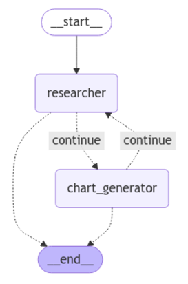
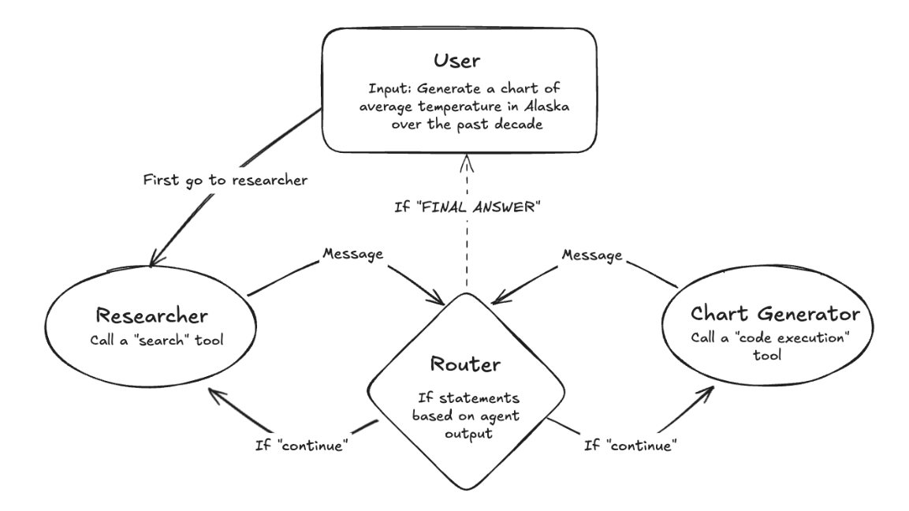
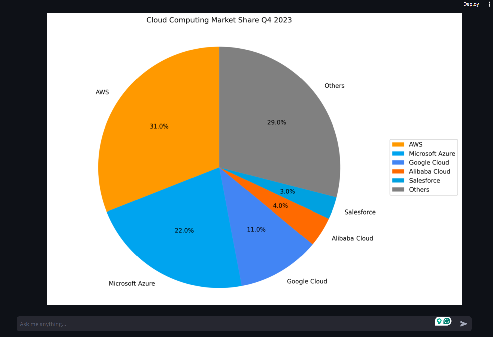
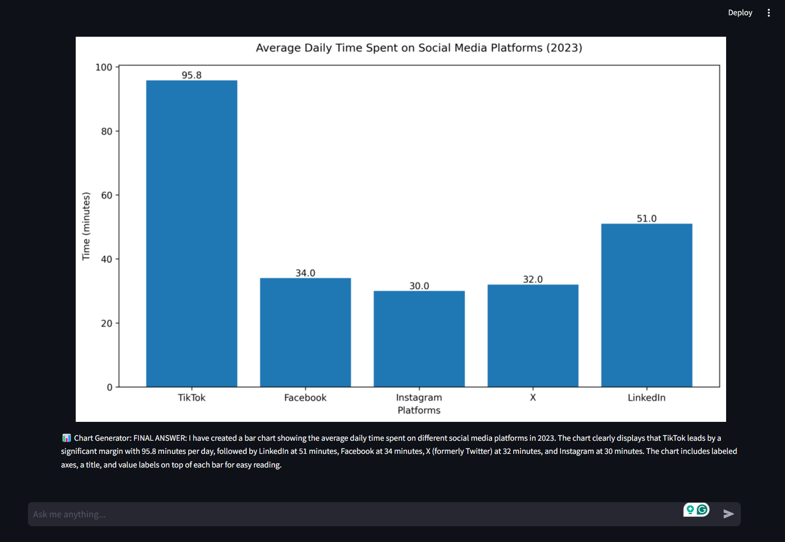
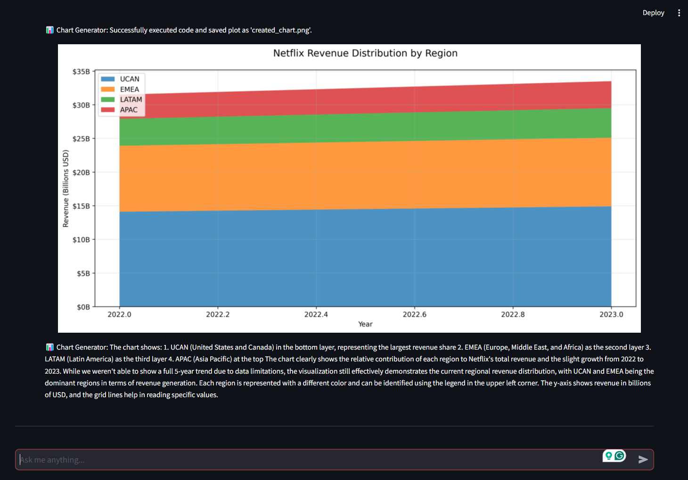
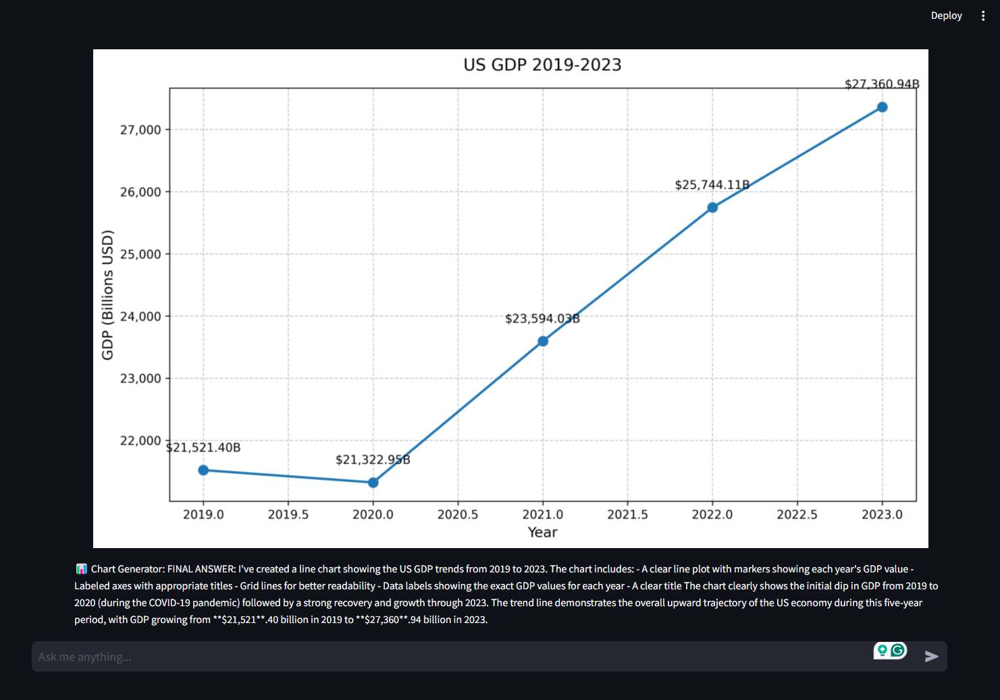

# AI Multi-Agent Collaboration with LangGraph: From Web Research to Data Visualization 🤖📊

## Overview

A sophisticated multi-agent system built with LangGraph that combines research and visualization capabilities. The system uses specialized agents (Researcher and Chart Generator) working together to analyze data and create visualizations, demonstrating the power of agent collaboration in handling complex queries.

## 🚀 Demo

Watch the demo: [YouTube Demo](https://youtu.be/rZSkYScTk_0)

## Agent Collaboration

The system demonstrates the power of multi-agent collaboration through a streamlined workflow. When a user submits a query, the Research Agent first scours the web using the Tavily search tool to gather relevant, up-to-date information. Once the data is collected, the Chart Generator Agent takes over, transforming the raw data into insightful visualizations using matplotlib. This seamless handoff between specialized agents showcases how LangGraph orchestrates complex tasks - from web research to data visualization - in a coordinated and efficient manner.

## Quick Links

- [LangGraph Documentation](https://python.langchain.com/docs/langgraph)
- [Streamlit Documentation](https://docs.streamlit.io/)
- [Claude API Documentation](https://docs.anthropic.com/claude/reference/getting-started-with-the-api)

## Sample Queries

Here are some example interactions with the system:

| | |
|:-------------------------:|:-------------------------:|
| Cloud Computing Market Share |   Social Media Usage |
| Social Media Usage |   US 5 year GDP|

Sample queries:
- "Research the market share of top 5 cloud computing providers in 2023 and create a pie chart to visualize their distribution. Once done, finish."     
- "Research the average daily time spent on different social media platforms (Instagram, X/Twitter, Facebook, TikTok, LinkedIn) in 2023, and create a bar chart showing the comparison in minutes. Once done, finish."      
- "Find data about Netflix's revenue distribution across regions (Americas, Europe, Asia) for the past 5 years and create a stacked area chart. Once complete, finish."    

## Features

- **Multi-Agent Architecture**:
  - Research Agent for data gathering
  - Chart Generator Agent for visualization
  - Coordinated workflow between agents
- **Advanced Visualization**:
  - Line charts
  - Bar charts
  - Pie charts
  - Custom styling and formatting
- **Interactive Interface**:
  - Real-time chat interface
  - Progress indicators
  - Dynamic result display
- **Data Processing**:
  - Web research capabilities
  - Data cleaning and formatting
  - Automated chart generation

## Technology Stack

- **Core Framework**:
  - Python
  - LangGraph for agent orchestration
  - LangChain for LLM integration
  - Claude-3 for intelligence
- **Frontend**:
  - Streamlit for web interface
  - Matplotlib for visualization
- **Tools**:
  - Tavily for web search
  - Python REPL for code execution
  - Custom formatting utilities

## Usage

To run the Seedbot assistant:
`streamlit run streamlit_app.py`

## Acknowledgments

- Thanks to the LangGraph team for the excellent framework
- Inspired by [LangGraph's Multi-Agent Tutorial](https://github.com/langchain-ai/langgraph/blob/main/docs/docs/tutorials/multi_agent/multi-agent-collaboration.ipynb) for the agent collaboration architecture, and [LangGraph's end-to-end application deployment tutorial](https://github.com/langchain-ai/langgraph-example)
- Thanks to [Krish Naik's tutorial](https://www.youtube.com/watch?v=N1FM-PcVXNA) for insights on building LangGraph based multi-agent systems
